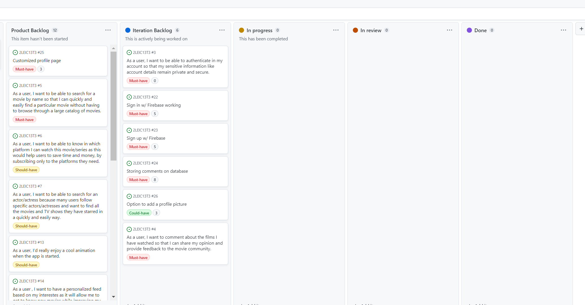

hello!

<h3> Sprint 0 </h3>

<h5> Retro </h5>

1. The design of the architure went almost perfectly. On the other hand, the user stories and acceptance tests also went pretty nicely.
2. Some mockups were missing. Also, we forgot to upload the Product Vision. 
3. We have developed our task delegation skills.
4. I feel there's nothing that we didn't quite understand.

<h3> Sprint 1</h3>

<h5> Board at sprint's beggining </h5>

