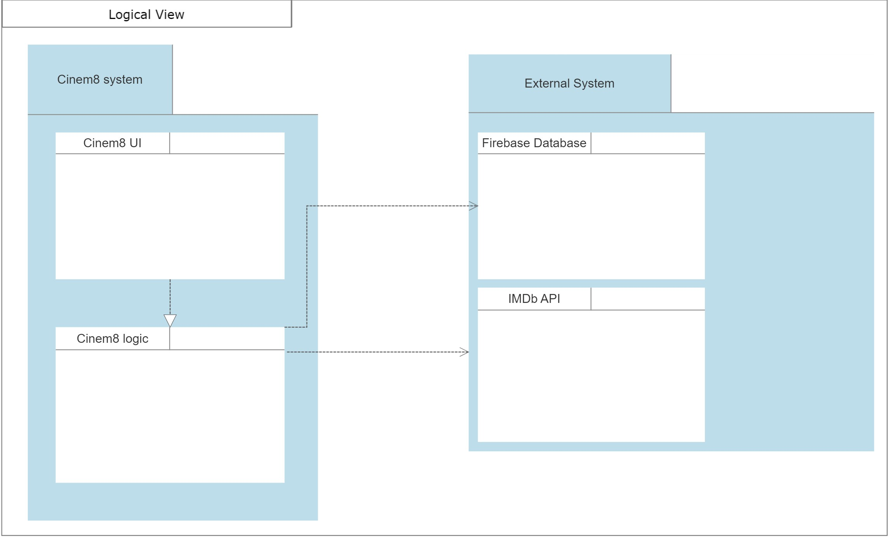

# project

A new Flutter project.

## Getting Started

This project is a starting point for a Flutter application.

A few resources to get you started if this is your first Flutter project:

- [Lab: Write your first Flutter app](https://docs.flutter.dev/get-started/codelab)
- [Cookbook: Useful Flutter samples](https://docs.flutter.dev/cookbook)

For help getting started with Flutter development, view the
[online documentation](https://docs.flutter.dev/), which offers tutorials,
samples, guidance on mobile development, and a full API reference.

## Domain Model

This model contains the following classes:
  * App - This class represents the whole application in an abstract context. This class has 2 key fields, the name and description
    of the app.
    
  * user_App - This class represents the whole application, but this time this application is referent to one user only. The class App contains one or more
    user_App classes because the application is used by many Users.
    
  * User - This class represents the user of the app. A user can have a firstname and a lastname. One user can only have one user_App for the same login.
    One user can have only one of two roles on the app. A user is an ## administrator (full control of developer tools), or a ## public user (only access to the           frontend of the app).

  * Login- This class represents the authentication of the user in the app. A login in the app must contain two fields, both username and password. Login also has a id
    that is unique and generated automatically for the case different users have the same username and/or password. In this app user must have an account to access all
    funcionalities.

  * Feed - This class represents the main page of the app. In this page the user can see an infinite loop of a list of movies. This movies are shown by their trailers    and they can be accessed by clicking on them. The state of the feed can be changed with filters.
  
  * Filter- This class represents the different ways how feed can be shown to the user. Filters like genre,actor and awards can be applied to satisfy the user.

  * Watchlist - This class represents the watchlist, which contains a list of movies that user set to be watched later. A user can change the name of his watchlist.

  * Movie - This class represents a movie .  A movie can have multiple fields like title,genre,duration... . This movies contains reviews , where users can comment       about the movie and assign a rating. Movie is a generalized class of Liked movie and Reviewed Movie. This two features are not necessary and can be both set for an     object belonging to movie.

  * Review - This class represents a review where a user can give his opinion about the movie and give a rating for the movie. A user can have multiple reviews for all   movies.
  
  * Search- This class represents the search for a movie and it´s used sucessfully when a user enter a movie title. Feed can show infinite movies ,but the search         feature can show only one movie at a time.

## Physical Architecture

Cinem8 app physical architecture follows a simple path. First the smartphone containing the application(cinem8.apk) is connected to an application server (flutter server), where multiple user services files are written in dart files. The connection between smartphone and application server is made by protocol TCP which belongs to the
family of HTTP/HTTPS protocols. The application server gets data both from IMDb API and a databasse where the server stores data or reads data. The database system is
firebase which helps keeping data like login, user settings and others ... .Both Database and IMDb API can be acessed with HTTP protocl.

## Logical Architecture

The cinem8 app is divided into two main packages, the external devices packages, and Cinem8 system packages. Inside of the external devices packages , there are the
IMDb API package and Firebase package which represents the database content. Both this packages are core packages for the cinem8 logic package, which depends on the external device packages. Cinem8 packages contains a Cinem8 UI package that contains everything related to non-graphical and graphical user interfaces. This package implements the logic of Cinem8 logic package,

